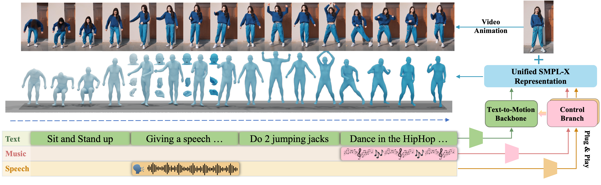

# MotionCraft

This repository contains the implementation of the paper "MotionCraft: Crafting Whole-Body Motion with Plug-and-Play Multimodal Controls"

Keywords: Motion Generation, Multimodal Controls

> [Yuxuan Bian](https://yxbian23.github.io/)<sup>1</sup>, [Ailing Zeng](https://ailingzeng.site/)<sup>2*</sup>, [Xuan Ju](https://github.com/juxuan27)<sup>1</sup>, [Xian Liu](https://alvinliu0.github.io/)<sup>1</sup>, [Zhaoyang Zhang](https://zzyfd.github.io/#/)<sup>1</sup>, [Wei Liu](https://scholar.google.com.hk/citations?hl=zh-CN&user=AjxoEpIAAAAJ)<sup>2</sup>, [Qiang Xu](https://cure-lab.github.io/)<sup>1*</sup><br>
> <sup>1</sup>The Chinese University of Hong Kong <sup>2</sup>Tencent <sup>*</sup>Corresponding Author


<p align="center">
  <a href="https://cure-lab.github.io/MotionCraft/">🌐Project Page</a> |
  <a href="https://arxiv.org/abs/2407.21136">📜Arxiv</a> |
  <a href="https://arxiv.org/pdf/2407.21136">📃PDF</a> |
  <a href="https://github.com/cure-lab/MotionCraft">🗄️Data</a> |
  <a href="https://cure-lab.github.io/MotionCraft/">📹Video</a>
</p>


**📖 Table of Contents**


- [MotionCraft](#motioncraft)
  - [TODO](#todo)
  - [🧭 Method Overview](#-method-overview)
  - [🛠️ Paper Abstract](#️-paper-abstract)
  - [🚀 Getting Started](#-getting-started)
    - [Environment Requirement 🌍](#environment-requirement-)
    - [Data Download ⬇️](#data-download-️)
  - [🏃🏼 Running Scripts](#-running-scripts)
    - [Training 🤯](#training-)
    - [Visualization 📜](#visualization-)
    - [Evaluation 📏](#evaluation-)
  - [🤝🏼 Cite Us](#-cite-us)
  - [💖 Acknowledgement](#-acknowledgement)


## TODO

- [x] Release evluation and visualization code
- [x] Release MC-Bench pre-processing code
- [ ] Release trainig code
- [ ] Release checkpoints
- [ ] Release gradio demo

## 🧭 Method Overview
We present MotionCraft, a diffusion transformer that crafts whole-body motion with plug-and-play multimodal controls, encompassing robust motion generation abilities including Text-to-Motion, Speech-to-Gesture, and Music-to-Dance.


## 🛠️ Paper Abstract

Whole-body multimodal motion generation, controlled by text, speech, or music, has numerous applications including video generation and character animation. However, employing a unified model to achieve various generation tasks with different condition modalities presents two main challenges: motion distribution drifts across different tasks (e.g., co-speech gestures and text-driven daily actions) and the complex optimization of mixed conditions with varying granularities (e.g., text and audio). Additionally, inconsistent motion formats across different tasks and datasets hinder effective training toward multimodal motion generation. In this paper, we propose MotionCraft, a unified diffusion transformer that crafts whole-body motion with plug-and-play multimodal control. Our framework employs a coarse-to-fine training strategy, starting with the first stage of text-to-motion semantic pre-training, followed by the second stage of multimodal low-level control adaptation to handle conditions of varying granularities. To effectively learn and transfer motion knowledge across different distributions, we design MC-Attn for parallel modeling of static and dynamic human topology graphs. To overcome the motion format inconsistency of existing benchmarks, we introduce MC-Bench, the first available multimodal whole-body motion generation benchmark based on the unified SMPL-X format. Extensive experiments show that MotionCraft achieves state-of-the-art performance on various standard motion generation tasks.


## 🚀 Getting Started

### Environment Requirement 🌍

MotionCraft has been implemented and tested on Pytorch 1.12.1 with python 3.9.

Clone the repo:

```
git clone https://github.com/cure-lab/MotionCraft.git
```

We recommend you first use `conda` to create virtual environment, and install `pytorch` following [official instructions](https://pytorch.org/). For example:


```
conda create -n motioncraft python=3.9 -y
conda activate motioncraft
conda install pytorch==1.12.1 torchvision==0.13.1 cudatoolkit=11.3 -c pytorch -y
```

Then, you can install mmcv with:

```
pip install "mmcv-full>=1.4.2,<=1.9.0"
```

After that, you can install required packages thourgh:

```
cd MotionCraft
pip install -r requirements.txt
```


### Data Download ⬇️


**Dataset**

You can download the all the original motion datasets and process them into the MC-Bench as follows, which are used for training and testing the BrushNet. By downloading the data, you are agreeing to the terms and conditions of the license. The data structure should be like:

```
|-- data
    |-- datasets
        |-- beats2/PantoMatrix
          |-- BEAT2
            |-- beat_english_v2.0.0
            |-- ...
          |-- datasets/beat_cache
            |-- beat_smplx_en_emage
            |-- beat_smplx_en_emage_test
          |-- EMAGE
          |-- mean.npy
          |-- std.npy
          |-- ...
        |-- finedance
          |-- label_json
          |-- motion
          |-- motion_fea163
          |-- music_npy
          |-- music_wav
          |-- mean.npy
          |-- std.npy
          |-- ...
        |-- motionx
          |-- motion_data/smplx_322/humanml
            |-- 000002.npy
            |-- 000003.npy
            |-- ...
          |-- texts/semantic_labels/humanml
            |-- 000002.txt
            |-- 000003.txt
          |-- humanml3d_clip_align.py
          |-- humanml3d_align_mean.npy
          |-- humanml3d_align_std.npy
          |-- humanml3d_align_test.txt
          |-- humanml3d_align_train_val.txt
          |-- humanml3d_origin_test.txt
          |-- humanml3d_origin_train_val.txt
    |-- evaluators
        |-- human_ml3d
          |-- finest.tar
        |-- smplx322
          |-- distilbert-base-uncased
          |-- epoch=199.ckpt
```
Noted: *Due to dataset license limitation, we can not redistribute the processed MC-Bench here. However, we provide detailed steps to construct from the original data sources.*

<details> <summary> Text-to-Motion Benchmark Construction </summary>

* Following the processing workflow of Mocap Datasets in [MotionX](https://github.com/IDEA-Research/Motion-X/tree/main/mocap-dataset-process), obtain a processed subset of SMPL-X HumanML3D from the raw AMASS dataset.
* Follow [the official preparation](https://github.com/EricGuo5513/text-to-motion/blob/f8eecd27341b04464e363f0acd993cabef52b1ce/data/dataset.py#L69) to align each motion data with different text annotations and different time intervals by running the following code:
  ```
  cd ./data/datasets/motionx
  mkdir motionx/motion_data/smplx_322/humanml3d_align_test
  mkdir motionx/motion_data/smplx_322/humanml3d_align_train_val
  mkdir motionx/texts/semantic_labels/humanml3d_align_test
  mkdir motionx/texts/semantic_labels/humanml3d_align_train_val

  python humanml3d_clip_align.py

  rm -rf motionx/motion_data/smplx_322/humanml
  rm -rf motionx/texts/semantic_labels/humanml

  mv motionx/motion_data/smplx_322/humanml3d_align_test/* motionx/motion_data/smplx_322/humanml3d_align_train_val/
  mv motionx/texts/semantic_labels/humanml3d_align_test/* motionx/texts/semantic_labels/humanml3d_align_train_val/
  rm -rf motionx/motion_data/smplx_322/humanml3d_align_test
  rm -rf motionx/texts/semantic_labels/humanml3d_align_test

  mv motionx/motion_data/smplx_322/humanml3d_align_train_val motionx/motion_data/smplx_322/humanml
  mv motionx/texts/semantic_labels/humanml3d_align_train_val motionx/texts/semantic_labels/humanml

  ```

  Noted: *As described in our paper, our base model has two variants: MotionCraft-Basic and MotionCraft-Mix. MotionCraft-Basic refers to the model where the first stage is trained only on the HumanML3D subset of MC-Bench, while MotionCraft-Mix refers to the model where the first stage is trained on all subsets of MC-Bench (HumanML3D, BEAT2, FineDance). The text processing components for the latter two are included in the Speech-to-Motion Benchmark Construction and Music-to-Dance Benchmark Construction.*

</details>


<details> <summary> Speech-to-Gesture Benchmark Construction </summary>

* Clone the original BEAT2 dataset:
  ```
  cd ./data/datasets/beats2
  git clone https://github.com/PantoMatrix/PantoMatrix.git
  cd PantoMatrix
  git lfs install
  git clone https://huggingface.co/datasets/H-Liu1997/BEAT2
  ```
* Prepare relevant statistical metrics:
  ```
  mv ./data/datasets/beats2/mean.npy ./data/datasets/beats2/PantoMatrix/
  mv ./data/datasets/beats2/std.npy ./data/datasets/beats2/PantoMatrix/
  ```
</details>

<details> <summary> Music-to-Dance Benchmark Construction </summary>

* Download and organize the data as [FineDance](https://github.com/li-ronghui/FineDance?tab=readme-ov-file):
  * label_json: contains the song name, coarse style and fine-grained genre.
  * motion: contains the SMPLH format motion data.
  * music_wav: contains the music data in 'wav' format.
  * music_npy: contains the music feature extracted by librosa follow AIST++
* Transform the original SMPL-H FineDance data into data in the SMPL-X format:
  ```
  cd ./data/datasets/finedance
  python pre_motion.py
  ```
</details>

<details> <summary> Evaluation Checkpoints Preparation </summary>

* Download the `distilbert/distilbert-base-uncased`:
  ```
  cd ./data/evaluators/smplx322
  git lfs install
  git clone https://huggingface.co/distilbert/distilbert-base-uncased
  ```
* Download our pre-trained [text-encoder and motion encoder](https://drive.google.com/drive/folders/1cy3tRnMpb1k-A3bX2rY4JlY8cMENPLZ2?usp=drive_link) and put them under [here](./data/evaluators/smplx322) for evaluation.
</details>

**Checkpoints**

Checkpoints are coming soon.

## 🏃🏼 Running Scripts


### Training 🤯

Code is coming soon!


### Visualization 📜

You can inference with the script to get the corresponding visualization:

```
# text-to-motion
bash ./tools/visualize.sh
# speech-to-gesture
bash ./tools/s2g_visualize.sh
# music-to-dance
bash ./tools/m2d_visualize.sh
```

Noted: *For detailed usage of the parameters, please refer to [visualize.py](tools/visualize.py), [s2g_visualize.py](tools/s2g_visualize.py), and [m2d_visualize.py](tools/m2d_visualize.py) respectively.*

### Evaluation 📏

You can evaluate using the script:

```
# text-to-motion
bash ./tools/single_test.sh
# speech-to-gesture
bash ./tools/s2g_test.sh
# music-to-dance
bash ./tools/m2d_test.sh
```

Noted: *For detailed usage of the parameters, please refer to [test.py](tools/test.py), [s2g_test.py](tools/s2g_test.py), and [m2d_test.py](tools/m2d_test.py) respectively.*


## 🤝🏼 Cite Us

```
@article{bian2024adding,
  title={Adding Multi-modal Controls to Whole-body Human Motion Generation},
  author={Bian, Yuxuan and Zeng, Ailing and Ju, Xuan and Liu, Xian and Zhang, Zhaoyang and Liu, Wei and Xu, Qiang},
  journal={arXiv preprint arXiv:2407.21136},
  year={2024}
}
```


## 💖 Acknowledgement
<span id="acknowledgement"></span>

Our code is mainly modified based on [FineMoGen](https://github.com/mingyuan-zhang/FineMoGen), and we refer to the [HumanTomato](https://github.com/IDEA-Research/HumanTOMATO) for OpenTMA evaluation pipelines. Thanks to all the authors!
